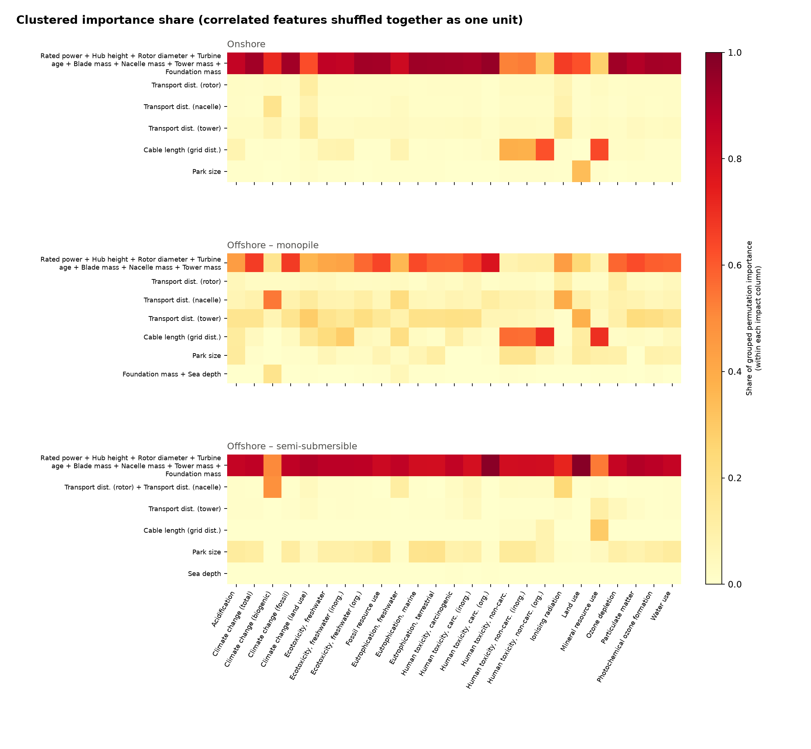
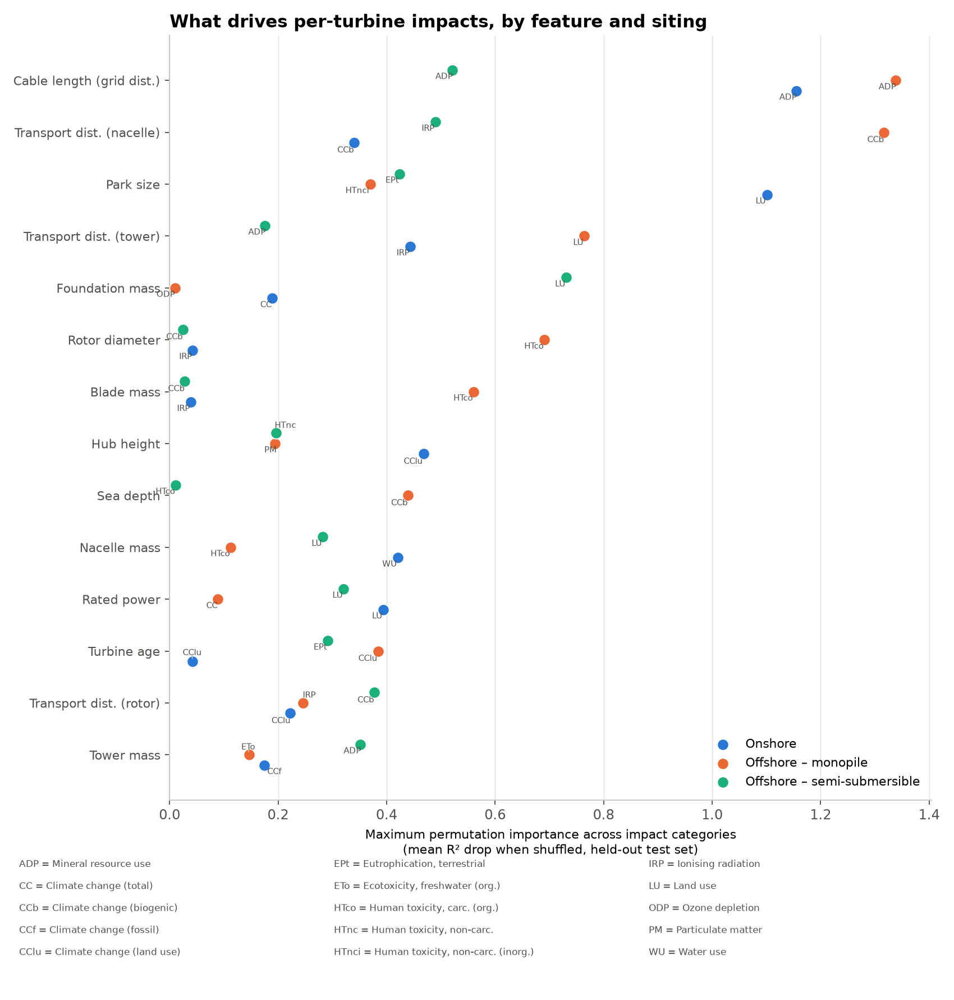

# What actually drives per-turbine impacts, by category and siting

Generated by `generate_feature_importance.py`, across all 77,552 turbines in the fleet. This is a descriptive exercise, not a discovery one: `fleet_evaluation_lca_algebraic.py`'s formulas for how rated power, rotor diameter, hub height, cable length, etc. map to material mass and each of the 25 EF3.0 impact categories are already known exactly (the model is symbolic, not a black box). The point here is to confirm, in the actual fleet data, which of those known drivers matters most, for every impact category and not just the headline climate metric, and to check whether the answer changes with how a turbine is sited.

Onshore and offshore turbines are modeled **separately**, and offshore is further split by foundation type (monopile, semi-submersible, spar), rather than mixed together with an `Offshore` 0/1 feature as in the earlier single-metric version of this analysis. Sea depth is meaningless onshore (always 0) and foundation type changes which formulas apply, so pooling categories together was hiding that structure rather than revealing it.

## Method

A random forest (300 trees, max depth 12) trained per (turbine category, impact category) pair, up to 4 x 25 = 100 models, on an 80/20 train/test split. Two rankings per model, computed two different ways so neither's blind spots go unchecked: the model's own impurity-based `feature_importances_`, and permutation importance (how much held-out R² drops when a single feature is shuffled, averaged over 15 repeats). Permutation is the more trustworthy of the two, since impurity-based importance is known to inflate high-cardinality continuous features.

Onshore uses 13 features (no sea depth, always 0). Offshore categories use 14 features (adds sea depth). Categories with fewer than 30 turbines are reported but not modeled: an 80/20 split on a handful of rows doesn't produce a meaningful ranking.

## Multicollinearity: why individual rankings need a second opinion

Permutation importance is known to misattribute credit when predictors are correlated: shuffling one of two correlated features barely hurts the model, since it can still read the same signal off the other one, so importance gets split or hidden rather than measured (Strobl, Boulesteix, Kneib, Augustin & Zeileis, "Conditional variable importance for random forests", *BMC Bioinformatics* 2008). This fleet has real collinearity: rated power, rotor diameter, hub height, and turbine age correlate at Spearman |r| up to 0.93 (bigger, newer turbines are simultaneously taller, wider-rotor, and higher-rated: one underlying trend, four correlated measurements of it).

Mitigation follows scikit-learn's own documented approach for this problem (*Permutation Importance with Multicollinear or Correlated Features*): cluster features by hierarchical clustering on Spearman-correlation distance (merge at |r| ≥ 0.7, a standard high-correlation cutoff), then shuffle every feature in a cluster together. This credits the cluster as a whole instead of letting the credit land arbitrarily on whichever member wins tie-breaking. Both the individual ranking (heatmap and per-impact figures above) and this clustered ranking are reported; where they agree, the individual ranking is trustworthy. Where a feature's individual rank is high but it's clustered with others, read the *cluster*, not that one feature, as the real finding.

**Onshore clusters**: Rated power + Hub height + Rotor diameter + Turbine age + Blade mass + Nacelle mass + Tower mass + Foundation mass; Transport dist. (rotor); Transport dist. (nacelle); Transport dist. (tower); Cable length (grid dist.); Park size.

**Offshore – monopile clusters**: Rated power + Hub height + Rotor diameter + Turbine age + Blade mass + Nacelle mass + Tower mass; Transport dist. (rotor); Transport dist. (nacelle); Transport dist. (tower); Cable length (grid dist.); Park size; Foundation mass + Sea depth.

**Offshore – semi-submersible clusters**: Rated power + Hub height + Rotor diameter + Turbine age + Blade mass + Nacelle mass + Tower mass + Foundation mass; Transport dist. (rotor) + Transport dist. (nacelle); Transport dist. (tower); Cable length (grid dist.); Park size; Sea depth.



Each per-impact figure above also marks individually non-significant features "(n.s.)": a one-sided one-sample t-test on the 15 permutation-repeat values per feature (H1: mean importance > 0), using scikit-learn's own raw per-repeat output (normally discarded once `.importances_mean` is read). p < 0.05 is treated as significant; how many of the candidate features clear that bar for each impact is in the per-impact table below.

## Summary: importance across all impact categories, by siting


Each row of each panel is a feature, each column an impact category; color is that feature's permutation importance as a share of the total within that column (columns sum to 1). Reading across a panel shows whether one or two features dominate every impact (a mostly-uniform column pattern) or whether the ranking reshuffles impact-by-impact.

## Summary: each feature's single best impact category, by siting



One point per (feature, turbine category): that feature's LARGEST permutation importance across all 25 impact categories (raw R² drop, not a column-normalized share as in the heatmap above), labeled with the impact category that produced it (abbreviations in the table below). Component masses (blade/nacelle/tower/foundation) are deterministic functions of rated power, hub height, rotor diameter and (offshore) sea depth already in the feature list -- see the Multicollinearity section: where a mass and its generating dimension both rank high, read that as one finding reported twice, not two independent drivers.

| Abbrev. | Impact category | Abbrev. | Impact category |
|---|---|---|---|
| AC | Acidification | CC | Climate change (total) |
| CCb | Climate change (biogenic) | CCf | Climate change (fossil) |
| CClu | Climate change (land use) | ET | Ecotoxicity, freshwater |
| ETi | Ecotoxicity, freshwater (inorg.) | ETo | Ecotoxicity, freshwater (org.) |
| FRU | Fossil resource use | EPf | Eutrophication, freshwater |
| EPm | Eutrophication, marine | EPt | Eutrophication, terrestrial |
| HTc | Human toxicity, carcinogenic | HTci | Human toxicity, carc. (inorg.) |
| HTco | Human toxicity, carc. (org.) | HTnc | Human toxicity, non-carc. |
| HTnci | Human toxicity, non-carc. (inorg.) | HTnco | Human toxicity, non-carc. (org.) |
| IRP | Ionising radiation | LU | Land use |
| ADP | Mineral resource use | ODP | Ozone depletion |
| PM | Particulate matter | POF | Photochemical ozone formation |
| WU | Water use |  |  |

## Onshore (n=72,173)

Held-out R² across the 25 impact categories ranges 0.728–0.965 (mean 0.917).

| Impact category | Held-out R² | Top feature (permutation) | Significant (p<0.05) |
|---|---|---|---|
| Acidification | 0.915 | Nacelle mass | 13/13 |
| Climate change (total) | 0.939 | Rated power | 13/13 |
| Climate change (biogenic) | 0.920 | Transport dist. (nacelle) | 13/13 |
| Climate change (fossil) | 0.939 | Nacelle mass | 13/13 |
| Climate change (land use) | 0.728 | Hub height | 13/13 |
| Ecotoxicity, freshwater | 0.923 | Rated power | 13/13 |
| Ecotoxicity, freshwater (inorg.) | 0.923 | Nacelle mass | 13/13 |
| Ecotoxicity, freshwater (org.) | 0.937 | Nacelle mass | 13/13 |
| Fossil resource use | 0.932 | Nacelle mass | 13/13 |
| Eutrophication, freshwater | 0.922 | Hub height | 13/13 |
| Eutrophication, marine | 0.936 | Rated power | 13/13 |
| Eutrophication, terrestrial | 0.932 | Rated power | 13/13 |
| Human toxicity, carcinogenic | 0.938 | Rated power | 13/13 |
| Human toxicity, carc. (inorg.) | 0.918 | Nacelle mass | 13/13 |
| Human toxicity, carc. (org.) | 0.965 | Rated power | 13/13 |
| Human toxicity, non-carc. | 0.901 | Cable length (grid dist.) | 13/13 |
| Human toxicity, non-carc. (inorg.) | 0.901 | Cable length (grid dist.) | 13/13 |
| Human toxicity, non-carc. (org.) | 0.904 | Cable length (grid dist.) | 13/13 |
| Ionising radiation | 0.910 | Transport dist. (tower) | 13/13 |
| Land use | 0.913 | Park size | 13/13 |
| Mineral resource use | 0.909 | Cable length (grid dist.) | 13/13 |
| Ozone depletion | 0.939 | Rated power | 13/13 |
| Particulate matter | 0.922 | Rated power | 13/13 |
| Photochemical ozone formation | 0.926 | Rated power | 13/13 |
| Water use | 0.935 | Nacelle mass | 13/13 |

#### Acidification


#### Climate change (total)


#### Climate change (biogenic)


#### Climate change (fossil)


#### Climate change (land use)


#### Ecotoxicity, freshwater


#### Ecotoxicity, freshwater (inorg.)


#### Ecotoxicity, freshwater (org.)


#### Fossil resource use


#### Eutrophication, freshwater


#### Eutrophication, marine


#### Eutrophication, terrestrial


#### Human toxicity, carcinogenic


#### Human toxicity, carc. (inorg.)


#### Human toxicity, carc. (org.)


#### Human toxicity, non-carc.


#### Human toxicity, non-carc. (inorg.)


#### Human toxicity, non-carc. (org.)


#### Ionising radiation


#### Land use


#### Mineral resource use


#### Ozone depletion


#### Particulate matter


#### Photochemical ozone formation


#### Water use


## Offshore – monopile (n=4,122)

Held-out R² across the 25 impact categories ranges 0.964–0.988 (mean 0.977).

| Impact category | Held-out R² | Top feature (permutation) | Significant (p<0.05) |
|---|---|---|---|
| Acidification | 0.979 | Transport dist. (tower) | 14/14 |
| Climate change (total) | 0.975 | Blade mass | 14/14 |
| Climate change (biogenic) | 0.988 | Transport dist. (nacelle) | 14/14 |
| Climate change (fossil) | 0.975 | Blade mass | 14/14 |
| Climate change (land use) | 0.964 | Transport dist. (tower) | 14/14 |
| Ecotoxicity, freshwater | 0.977 | Cable length (grid dist.) | 14/14 |
| Ecotoxicity, freshwater (inorg.) | 0.978 | Cable length (grid dist.) | 14/14 |
| Ecotoxicity, freshwater (org.) | 0.970 | Transport dist. (tower) | 14/14 |
| Fossil resource use | 0.975 | Blade mass | 14/14 |
| Eutrophication, freshwater | 0.985 | Transport dist. (nacelle) | 14/14 |
| Eutrophication, marine | 0.978 | Transport dist. (tower) | 14/14 |
| Eutrophication, terrestrial | 0.976 | Transport dist. (tower) | 14/14 |
| Human toxicity, carcinogenic | 0.977 | Blade mass | 14/14 |
| Human toxicity, carc. (inorg.) | 0.976 | Blade mass | 14/14 |
| Human toxicity, carc. (org.) | 0.986 | Rotor diameter | 14/14 |
| Human toxicity, non-carc. | 0.981 | Cable length (grid dist.) | 14/14 |
| Human toxicity, non-carc. (inorg.) | 0.981 | Cable length (grid dist.) | 14/14 |
| Human toxicity, non-carc. (org.) | 0.986 | Cable length (grid dist.) | 14/14 |
| Ionising radiation | 0.981 | Transport dist. (nacelle) | 14/14 |
| Land use | 0.964 | Transport dist. (tower) | 14/14 |
| Mineral resource use | 0.981 | Cable length (grid dist.) | 14/14 |
| Ozone depletion | 0.978 | Transport dist. (rotor) | 14/14 |
| Particulate matter | 0.974 | Rotor diameter | 14/14 |
| Photochemical ozone formation | 0.974 | Transport dist. (tower) | 14/14 |
| Water use | 0.973 | Blade mass | 14/14 |

#### Acidification


#### Climate change (total)


#### Climate change (biogenic)


#### Climate change (fossil)


#### Climate change (land use)


#### Ecotoxicity, freshwater


#### Ecotoxicity, freshwater (inorg.)


#### Ecotoxicity, freshwater (org.)


#### Fossil resource use


#### Eutrophication, freshwater


#### Eutrophication, marine


#### Eutrophication, terrestrial


#### Human toxicity, carcinogenic


#### Human toxicity, carc. (inorg.)


#### Human toxicity, carc. (org.)


#### Human toxicity, non-carc.


#### Human toxicity, non-carc. (inorg.)


#### Human toxicity, non-carc. (org.)


#### Ionising radiation


#### Land use


#### Mineral resource use


#### Ozone depletion


#### Particulate matter


#### Photochemical ozone formation


#### Water use


## Offshore – semi-submersible (n=1,255)

Held-out R² across the 25 impact categories ranges 0.970–0.999 (mean 0.989).

| Impact category | Held-out R² | Top feature (permutation) | Significant (p<0.05) |
|---|---|---|---|
| Acidification | 0.990 | Foundation mass | 14/14 |
| Climate change (total) | 0.991 | Foundation mass | 14/14 |
| Climate change (biogenic) | 0.991 | Transport dist. (rotor) | 14/14 |
| Climate change (fossil) | 0.991 | Foundation mass | 14/14 |
| Climate change (land use) | 0.972 | Foundation mass | 13/14 |
| Ecotoxicity, freshwater | 0.989 | Foundation mass | 14/14 |
| Ecotoxicity, freshwater (inorg.) | 0.991 | Foundation mass | 14/14 |
| Ecotoxicity, freshwater (org.) | 0.989 | Foundation mass | 13/14 |
| Fossil resource use | 0.989 | Foundation mass | 13/14 |
| Eutrophication, freshwater | 0.994 | Foundation mass | 14/14 |
| Eutrophication, marine | 0.990 | Foundation mass | 13/14 |
| Eutrophication, terrestrial | 0.990 | Park size | 13/14 |
| Human toxicity, carcinogenic | 0.983 | Foundation mass | 13/14 |
| Human toxicity, carc. (inorg.) | 0.973 | Foundation mass | 13/14 |
| Human toxicity, carc. (org.) | 0.993 | Foundation mass | 14/14 |
| Human toxicity, non-carc. | 0.999 | Park size | 14/14 |
| Human toxicity, non-carc. (inorg.) | 0.999 | Foundation mass | 14/14 |
| Human toxicity, non-carc. (org.) | 0.998 | Foundation mass | 14/14 |
| Ionising radiation | 0.999 | Transport dist. (nacelle) | 14/14 |
| Land use | 0.970 | Foundation mass | 11/14 |
| Mineral resource use | 0.983 | Cable length (grid dist.) | 13/14 |
| Ozone depletion | 0.992 | Foundation mass | 14/14 |
| Particulate matter | 0.988 | Foundation mass | 13/14 |
| Photochemical ozone formation | 0.990 | Foundation mass | 14/14 |
| Water use | 0.990 | Foundation mass | 13/14 |

#### Acidification


#### Climate change (total)


#### Climate change (biogenic)


#### Climate change (fossil)


#### Climate change (land use)


#### Ecotoxicity, freshwater


#### Ecotoxicity, freshwater (inorg.)


#### Ecotoxicity, freshwater (org.)


#### Fossil resource use


#### Eutrophication, freshwater


#### Eutrophication, marine


#### Eutrophication, terrestrial


#### Human toxicity, carcinogenic


#### Human toxicity, carc. (inorg.)


#### Human toxicity, carc. (org.)


#### Human toxicity, non-carc.


#### Human toxicity, non-carc. (inorg.)


#### Human toxicity, non-carc. (org.)


#### Ionising radiation


#### Land use


#### Mineral resource use


#### Ozone depletion


#### Particulate matter


#### Photochemical ozone formation


#### Water use


## Offshore – spar (n=2)

Only 2 turbines in the fleet in this category, below the 30-sample threshold for a meaningful train/test split. Excluded from modeling; not enough data to rank feature importance.

## Why: the known formulas behind rated power, hub height, and rotor diameter

These aren't a black box's guess, they're read straight from `fleet_evaluation_lca_algebraic.py`:

```
M_tower_sym   = (3.03584782e-04 * d**2 * h + 9.68652909) * 1e3   # tower steel mass, kg
M_nacelle_sym = (1.66691134e-06 * P**2 + 3.20700974e-02 * P) * 1e3   # nacelle mass, kg
M_rotor_sym   = (0.00460956 * d**2 + 0.11199577 * d) * 1e3           # rotor (blades+hub) mass, kg
```

Hub height (`h`) only ever appears in the tower formula, linearly. Rotor diameter (`d`) appears in both the tower formula (quadratic) and the rotor formula (quadratic). Rated power (`P`) appears in the nacelle formula (quadratic) and, separately, sets the whole turbine's scale almost everywhere else in the model: material percentage splits, transport formulas, and the cable mass term below all scale with `P` directly or indirectly. This shows up consistently across most impact categories and siting types in the tables above, which is exactly what the importance ranking finds independently, with no knowledge of the formulas going in.

Cable length works differently, and is real but genuinely smaller:

```
M_cable_sym = (300.0 * P / 21516.0) * 1e-6 * dist_to_grid * 8960.0 * (617.0 / 220.0) * 0.5
```

Cable mass is linear in `dist_to_grid`, but copper cable is a small fraction of a turbine's total mass next to steel tower, nacelle, and rotor.

## The scatter, and why it looks noisy


Neither panel shows a clean trend line, and that's expected given the importance ranking, not a contradiction of it: GWP100 per kWh is dominated by rated power and hub height, so plotting it against any *other* single feature (cable length) or even against rated power itself, without holding the other two fixed, mixes in that dominant variance as noise. This is the same relationship already quantified in `SUMMARY_STATISTICS.md` section 4 (GWP100 vs turbine age, Spearman r = -0.46), showing up here from a different angle.

## Limitations

This ranks 13-14 candidate features, not the full input space the algebraic model actually uses (component-level material percentage splits, park size interacting with maintenance/transport terms, per-country background electricity activities). A held-out R² in the ranges reported above means the ranking is trustworthy for these features on the impacts where R² is high; treat rankings for impacts with low R² more cautiously, since the model is explaining less of that impact's variance to begin with. The offshore spar category has only 2 turbines fleet-wide and isn't modeled at all.
