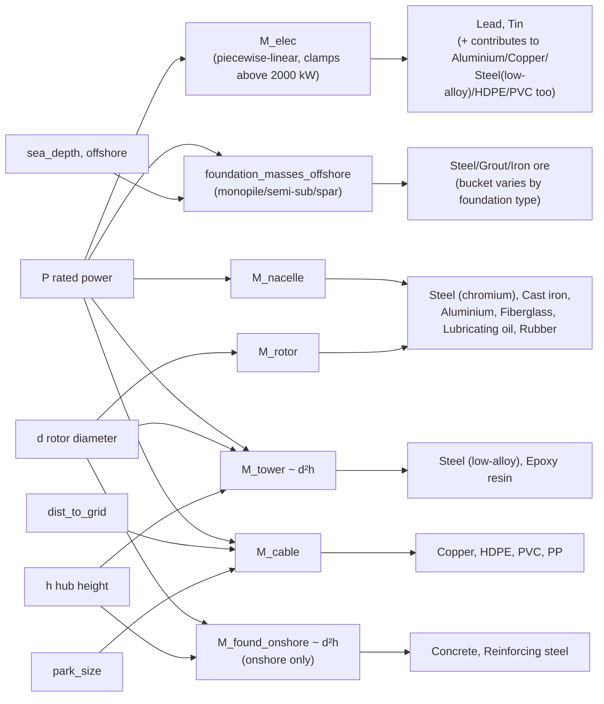
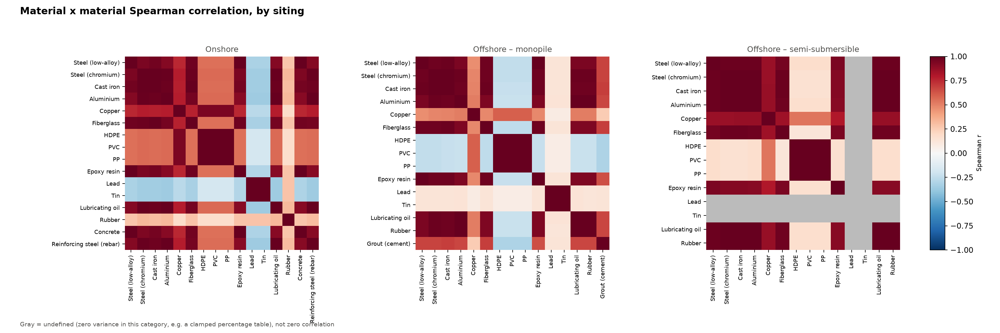
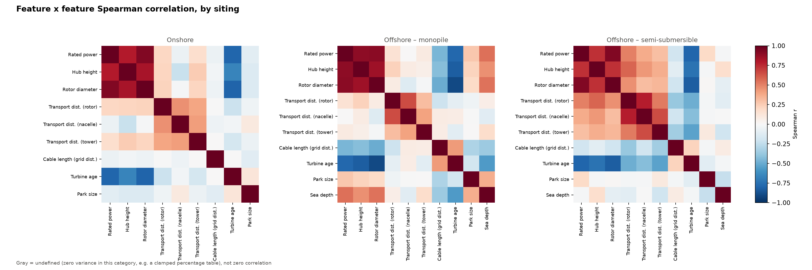
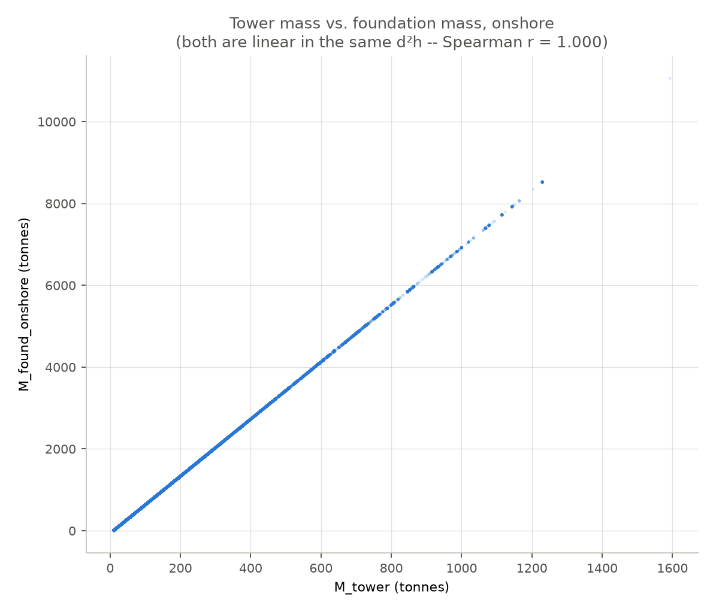
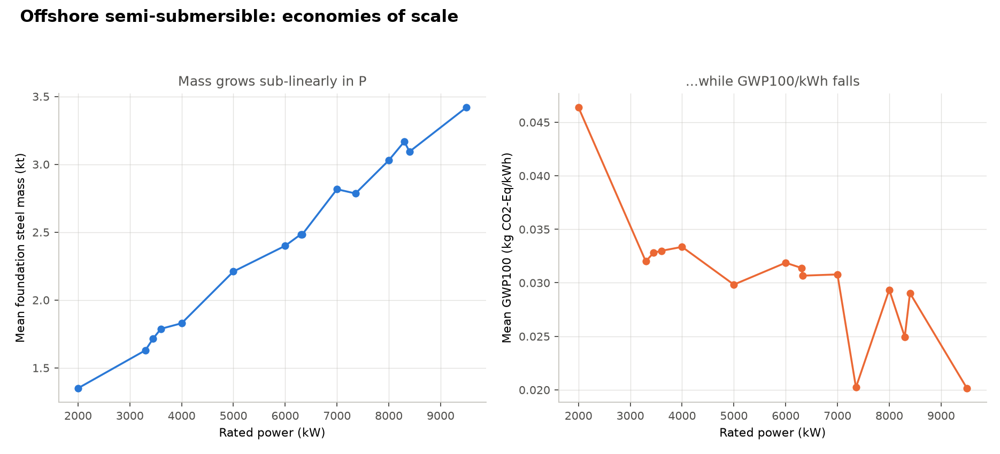

# Why the correlations look the way they do: tracing the formula dependency structure

`FEATURE_IMPORTANCE.md` and `MATERIAL_IMPORTANCE.md` report *what* correlates with *what*.
`IMPORTANCE_METHODOLOGY.md` explains *how* those numbers were computed. This document explains
*why* the correlation structure looks the way it does — tracing every cluster, every surprising
number, and every exception back to the actual formulas in `fleet_evaluation_lca_algebraic.py`
and the real fleet data, not general intuition about wind turbines. Every number below is
computed directly from the same per-turbine data the other reports use, not asserted.

---

## 1. The dependency skeleton

`P` (rated power), `d` (rotor diameter), `h` (hub height), `dist_to_grid` (cable length),
`park_size`, and (offshore only) `sea_depth` are turbine **characteristics** — six of the raw
features `FEATURE_IMPORTANCE.md` ranks directly. Every raw **material** mass is *derived* from
some subset of these six via the component-mass formulas below; materials are downstream of
features, not a separate category.

The other four features in `FEATURE_IMPORTANCE.md` aren't in this diagram because *material
mass* doesn't depend on them — not because they're unimportant to the LCA overall:

- **`dist_rotor`, `dist_nacelle`, `dist_tower`** are genuinely causal, just through a different
  formula family: the Transport-phase exchange multiplies each one directly by its component's
  *already-computed* mass (`dist_nacelle/1e6 · M_nacelle + dist_rotor/1e6 · M_rotor +
  dist_tower/1e6 · M_tower + ...`, `fleet_evaluation_lca_algebraic.py:712-719`) to get tonne-km
  transport burden. Transport is a real, separate contributor to every impact category (~8.8% of
  GWP100 EU-wide, `SUMMARY_STATISTICS.md` §3) — these three just don't change *how much steel or
  concrete a turbine has*, only how far it traveled to get there.
- **`turbine_age`** is different in kind: it appears in zero formulas anywhere in
  `fleet_evaluation_lca_algebraic.py` — not mass, not transport, not any exchange. It's a pure
  observational variable, useful to the random forest only because it happens to correlate with
  turbine size in this fleet (section 6 below), not because it has any direct causal role in the
  LCA calculation at all.

The actual correlation structure this skeleton produces, computed directly rather than only
described — every pattern discussed in sections 2 through 6 below is visible here at once:
the onshore/monopile structural block, the cable-materials split, Lead/Tin's negative
relationship with everything else, the `{P, hub height, rotor diameter, turbine age}` feature
cluster, monopile's weaker tower-foundation link, and the age/size fleet-composition pattern:

Two things about this skeleton drive almost everything found below:

1. **`M_tower(d,h)` and `M_found_onshore(d,h)` are both (near-)linear in the same product `d²h`.**
   Not similar — literally the same shape: `M_tower = 303.58·d²h + 9,686.5` and
   `M_found_onshore = 2.12·d²h` (no offset at all). Any material whose mass is `percentage × one
   of these` inherits that shape almost exactly.
2. **Everything else (`M_nacelle`, `M_elec`, `M_cable`) is a function of `P` and/or
   `dist_to_grid`/`park_size`/`sea_depth` — different inputs entirely.** Whether those end up
   correlated with the `d²h`-driven materials depends on how correlated `P`, `dist_to_grid`, etc.
   happen to be with `d²h` *in the real fleet* — an empirical fact about how this population of
   turbines was actually built and sited, not a property of the formulas themselves.

That distinction — **formulaic identity** (same shape, guaranteed correlated no matter what data
you feed it) vs. **empirical correlation** (happens to be correlated in this fleet, could in
principle not be) — is the thread running through every case study below.

---

## 2. Case study: onshore's near-total collapse into one dimension

The material clustering step (`MATERIAL_IMPORTANCE.md`, Multicollinearity section) put almost
every structural material into one cluster onshore. Checked directly, correlating the actual
component-mass values across all 72,173 onshore turbines:

| Pair | Spearman r | Why |
|---|---|---|
| `M_tower` vs `M_found_onshore` | **1.000** | Both are exactly linear in `d²h` — a formulaic identity, not a fleet coincidence |
| `M_tower` vs `M_elec(P)` | 0.853 | Not formulaic (`M_elec` depends on `P` alone) — inherited from `P` and `d²h` being empirically correlated at r=0.912 in this fleet |
| `M_tower` vs `M_cable(P, dist_to_grid)` | 0.550 | Weaker still: cable mass depends partly on `dist_to_grid`, which is essentially uncorrelated with `d²h` (r=-0.037) |
| `M_cable` vs `dist_to_grid` | 0.725 | Cable's real, independent driver |

That first row as a picture, not just a coefficient: every one of 72,173 turbines falls on
essentially the same line. This isn't a strong trend with scatter around it — it's two formulas
that reduce to the same shape.

So the reported "structural supercluster" (Steel, Concrete, Epoxy resin, Cast iron, Aluminium,
Fiberglass, Lubricating oil, Reinforcing steel) is genuinely one thing: `d²h`, i.e. how big the
turbine is. It merges at the clustering script's |r| ≥ 0.7 threshold because 1.000 and 0.853 both
clear it easily. Copper/HDPE/PVC/PP split off into their own cluster specifically because cable's
correlation (0.550) falls *below* that threshold — a real, verifiable break in the chain, not an
arbitrary cutoff choice landing on the wrong side by chance.

---

## 3. Case study: the clamping effect on Lead/Tin (a mechanism not documented before)

Lead and Tin are Electronics-only materials — the *only* raw materials whose mass never touches
`M_tower`, `M_nacelle`, or `M_rotor` at all, purely `percentage(P) × M_elec(P)`. `M_elec` is a
piecewise-linear interpolation with breakpoints at P = 30, 150, 600, 800, 2000 kW, and — like
every `sympy_interp`/`np.interp` table in this model — it **clamps** above its last breakpoint:
every turbine rated above 2000 kW gets the same `M_elec` value (3,946 kg), regardless of how much
bigger it actually is.

That clamping has a second-order effect nobody had checked before: it changes the *correlation
structure* between materials, depending on what fraction of a category's fleet sits above the
clamp.

| Category | Share of turbines with P ≥ 2000 kW (M_elec clamped) | corr(`M_tower`, `M_elec`) |
|---|---|---|
| Onshore | 57.9% | 0.853 |
| Offshore monopile | **99.4%** | **0.132** |

Onshore, a real 42% of the fleet still sits below the clamp, so `M_elec` still has genuine
variance left to correlate with turbine size. Offshore monopile, 99.4% of turbines are clamped —
`M_elec` is *functionally a constant* across almost the entire category, so its correlation with
everything else collapses toward zero (0.13, essentially noise from the remaining 0.6%), even
though `P` itself still correlates strongly with tower/foundation mass (0.93/0.67) in that same
fleet. This is why Lead and Tin land in their own singleton clusters for monopile and
semi-submersible (`MATERIAL_IMPORTANCE.md`'s cluster tables) but merge into the big structural
cluster onshore: not a different physical relationship, a different position relative to one
table's clamp.

---

## 4. Case study: offshore monopile breaks the `d²h` identity — and reveals a real siting pattern

Onshore, `M_tower` and `M_found_onshore` are exactly the same shape (r=1.000) because both are
pure functions of `d²h`. Offshore monopile's foundation formula is different —
`m_monopile = 5.28·P + 5,599.9·sea_depth + 102,643` — a function of `P` and `sea_depth`, not
`d²h` at all. Checked directly:

| Pair (offshore monopile) | Spearman r |
|---|---|
| `M_tower` vs `m_monopile` (foundation) | **0.642** (not 1.000) |
| `M_tower` vs `P` | 0.932 |
| `M_cable` vs `M_tower`/`m_monopile` | **-0.229 / -0.309** (negative) |
| `M_cable` vs `dist_to_grid` | 0.899 |
| `P` vs `dist_to_grid` | **-0.459** |

Two real findings here, not artifacts:

1. **The tower/foundation identity genuinely breaks for monopile.** `sea_depth` is a real,
   separate geographic variable (Spearman r with `P` is only -0.014 in this fleet — see
   `IMPORTANCE_METHODOLOGY.md` §5b), so foundation mass partially decouples from the rest of the
   turbine. This is exactly why `FEATURE_IMPORTANCE.md`'s grouped-importance heatmap shows
   monopile as the one category where cable length and individual transport distances carry real,
   visible weight rather than being swallowed by one dominant cluster (`IMPORTANCE_METHODOLOGY.md`
   §5d) — the underlying formulas are genuinely less collapsed onto a single dimension here.
2. **Bigger monopile turbines in this fleet are sited closer to shore.** `P` and `dist_to_grid`
   correlate at -0.459 — a real pattern in the data, not a modeling artifact — and it's strong
   enough to flip cable mass's correlation with turbine size *negative* (-0.23 to -0.31): larger
   turbines pull cable mass up via `P`, but their shorter export-cable runs pull it down harder.
   Whether this reflects genuine siting economics (larger farms justify shorter, higher-capacity
   export cables to minimize total infrastructure cost) or just which countries/sites happen to
   host the largest monopile turbines in this particular 38-country fleet isn't something this
   analysis can distinguish — worth a targeted look at the underlying country/site data before
   treating it as a general engineering principle.

---

## 5. Case study: why "Land use" has the lowest R² anywhere (0.347, materials/onshore)

Every impact category models well (R² > 0.85) except a handful, and materials/onshore Land use
(R² = 0.347) is the extreme case. Checked directly — correlating every onshore material *and*
characteristic against the Land use impact column:

| Variable | Spearman r vs. Land use |
|---|---|
| `park_size` | **-0.416** (strongest of anything, and negative) |
| Hub height | 0.222 |
| Concrete, Epoxy resin, Steel (low-alloy) | 0.18–0.19 |
| everything else | < 0.15 |

`park_size` — not any material — is the strongest single correlate, and it's negative. That
matches the underlying LCI mechanism directly: `fleet_evaluation_lca_algebraic.py` adds land-use
biosphere flows as a *shared, park-level* activity split `1/park_size` across the turbines in a
park (see that script's own land-use handling, documented in its section 9 comments) — a bigger
park spreads the same fixed land-transformation burden over more turbines, so per-turbine land
use falls as park size rises, largely independent of how much steel or concrete that turbine
itself contains.

This explains the R² gap precisely: `generate_material_importance.py`'s feature set doesn't
include `park_size` as a predictor at all (it's used internally only to help compute cable mass,
never exposed as its own column to the random forest) — so the materials model is missing Land
use's actual dominant driver entirely, not just under-weighting it. `generate_feature_importance.py`
*does* include `park_size` directly, and its Land use R² is correspondingly higher (0.729 vs.
0.347) — but still the second-lowest R² in that whole file, because -0.42 is a real but far from
complete correlation: even park_size only explains part of Land use's variance, consistent with
the rest of that mechanism (the P-dependent land-transformation-dataset percentages) not being
captured by *any* feature or material modeled here.

---

## 6. Case study: turbine age is a different *kind* of correlation entirely

Every correlation in sections 2–4 is formulaic: two quantities are highly correlated because
they're (near-)identical functions of the same underlying variable, by construction, regardless
of what data you feed them. Turbine age is not like that. There is no formula anywhere in
`fleet_evaluation_lca_algebraic.py` that computes `age` from `P`, `d`, or `h`, or vice versa — age
comes from a completely separate column in `EU_turbines_input_data.xlsx`, the installation year.

Its correlation with turbine size is real and strong (Spearman r: age vs. diameter -0.80, age vs.
rated power -0.79, onshore) — but it's a **fleet-composition** fact, not a **formula** fact: this
particular 38-country fleet happened to install bigger turbines in more recent years, a real
industry trend (larger rotors, taller towers, higher capacity factors becoming standard over
successive turbine generations), not a mathematical necessity. That distinction matters for how
much to trust the correlation holding up outside this dataset: the `d²h`-vs-`d²h` identities in
section 2 would hold for *any* wind turbine fleet, by construction; the age-vs-size correlation
would only hold for fleets with a similar historical growth trajectory to this one.

This is also the mechanism behind `SUMMARY_STATISTICS.md` §4's finding that turbine age has the
strongest of the three characteristic-level correlations with GWP100/kWh (Spearman r = -0.462):
age is standing in for turbine size (and the economies-of-scale effect in section 7 below), not
exerting some independent "newer materials are cleaner" effect of its own. The clustering step in
`FEATURE_IMPORTANCE.md` picks this up correctly — age merges into the `{P, d, h, age}` cluster in
every turbine category — but it's worth being explicit that this cluster contains one member
(age) whose membership is a fact about *this fleet's history*, not about physics.

---

## 7. Case study: semi-submersible's economies of scale, quantified

`IMPORTANCE_METHODOLOGY.md` §5b asserts bigger semi-submersible turbines carry less GWP100 per
kWh because mass grows slower than energy output. Here's that claim with actual numbers instead
of just the correlation coefficient (Spearman r = -0.65) that motivated it. Grouping the 1,255
semi-submersible turbines by their (few, discrete) rated-power values:

| | P = 2,000 kW (n=68) | P = 9,500 kW (n=61) | Ratio (max/min) |
|---|---|---|---|
| Rated power | 2,000 kW | 9,500 kW | **4.75×** |
| Steel foundation mass | 1.35 million kg | 3.42 million kg | **2.53×** |
| GWP100 per kWh | 0.0464 | 0.0201 | **2.30× lower** |

Every rated-power value in the fleet (not just the two endpoints in the table above), left panel
mass, right panel GWP100/kWh. The right panel is noisier — each point mixes turbines at
different sea depths, and some P values have very few turbines — but the downward trend past
P≈7,000 kW is visible directly, not just implied by the endpoint comparison.

Rated power rises 4.75×, but foundation steel mass — driven by
`m_semi_sub = 289.5·P + 17,828.6·sea_depth + 80,000` — only rises 2.53×, because the formula's
large additive constant (`sea_depth` term plus the flat 80,000 kg base) doesn't scale with `P` at
all, so it makes up proportionally less of the total as turbines get bigger. Meanwhile GWP100 per
kWh — lifetime impact divided by lifetime energy output — falls by more than half. Since embodied
mass more than doubles while per-kWh impact more than halves, the energy-output side of that
ratio must be growing substantially faster than the mass side: consistent with bigger turbines
both generating more power *and* achieving higher capacity factors, the standard economies-of-scale
story for offshore wind, now shown directly in this fleet's own numbers rather than asserted from
general knowledge.

---

## 8. What this means for reading `FEATURE_IMPORTANCE.md` / `MATERIAL_IMPORTANCE.md`

- A material or feature ranking #1 within a large cluster (section 2) is not a claim that *that
  specific* material/feature matters more than its cluster-mates — it's a claim that *the
  cluster* matters, with individual rank inside it close to arbitrary. Read the clustered heatmap,
  not the individual bar chart, for "which material/feature" claims.
- A weak individual correlation (e.g. any single material vs. Land use, section 5) can still mean
  the *true* driver is real and strong — just not one of the modeled columns. Low R² is a
  statement about this model's input space, not about whether the impact category has an
  explainable driver at all.
- A correlation holding at r > 0.99 (section 2's `d²h` identities) will hold for *any* fleet with
  these formulas; a correlation like age-vs-size (section 6) or monopile's size-vs-siting pattern
  (section 4) is a fact about *this* fleet's composition and might not generalize to a different
  country mix, a different decade, or a different foundation-type distribution.
